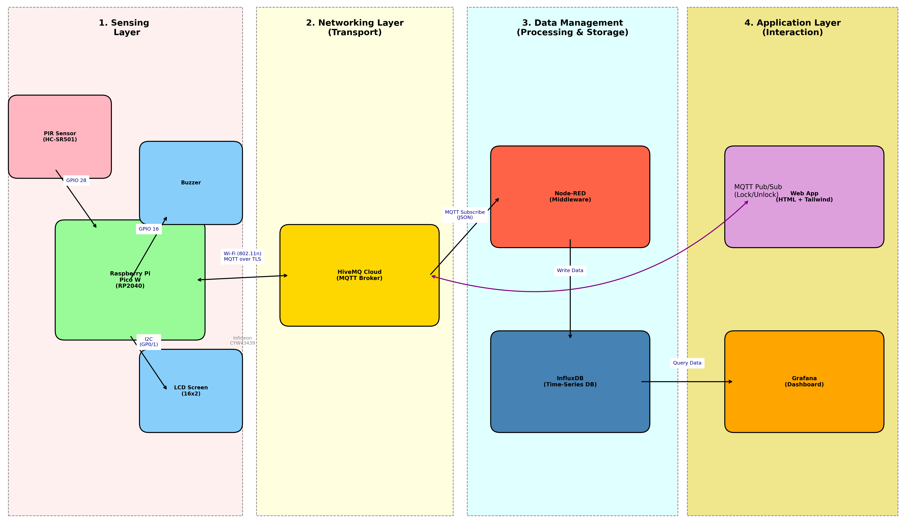

# Smart Intrusion Detection & Access Control System

This project is an Intrusion Detection & Access Control System designed for the IoT course at the University of Oulu. The system utilizes a Raspberry Pi Pico W to detect unauthorized motion, triggering both local and remote alarms. It integrates a custom Android mobile application for real-time monitoring and remote control of a physical locking mechanism. The solution leverages the MQTT protocol for low-latency communication and cloud-based data logging for historical analysis, with Hive used for HTTPS display.

## Architecture

# Setup

1. Open Thonny IDE and install packages for umqtt.simple and umqtt.robust.
2. Create a server in Hive MQ.
3. Edit all relevant info inside the .congfig file.
4. Make sure to connect with your phone internet, stable WIFI connection.

## Usage
### Wiring

1. 
2. 
3.

4. 

### Instructions

1. 
2. 
3. 

